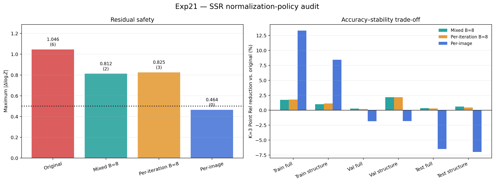

# Exp21：SSR 逐轮独立 BatchNorm 人口统计

## 实验问题

Exp19 的 batch-8 人口统计能同时小幅改善 train/val/test，但一套统计混合
K=1/2/3 后仍有两张残差离群。Exp20 改用每张图、每一轮即时统计后可消除全部
离群并显著改善训练拟合，却使验证和测试退化。

本实验在两者之间构造直接对照：卷积权重与 BN 仿射参数仍完全共享、完全不训练，
但为 K=1 至 K=5 分别用 100 张训练图和真实 batch 8 校准独立的人口均值/方差。
推理到第几轮就读取对应轮次的统计，从而同时保留跨图像人口统计和逐轮分布适配。

该设计不是论文公开结构，只用于检验当前复现中“一套 BN 缓冲混合多轮递归分布”
是否是剩余故障。

## 固定设计

- Exp15 step 800 原始检查点，权重与源文件均不修改；
- 100 张训练图、固定顺序、无增强、batch 8；
- 依次校准 K=1、K=2、K=3、K=4、K=5；
- 校准第 \(k\) 轮时，前 \(k-1\) 轮使用已经完成的人口统计；
- 每轮只更新自己的 running mean、running variance 和计数；
- 132 张图扫描 K=1/2/3 残差，完整评测 K=0/1/3/5；
- 与原始统计、Exp19 混合 batch-8 统计及 Exp20 单图即时统计对照；
- 阈值仍为 0.5，不训练、不放宽安全标准。

## 实验结果

校准与完整评测均已完成。统计文件大小为 397,607 bytes，峰值显存
7,533.62 MiB。校准前后 609 个非 BN 状态逐元素完全不变，108 个允许变化的
BN 缓冲均发生更新，因此下表差异不是继续训练权重造成的。
正式流水线运行于 08:58:44–09:02:40，退出码为 0；巡检分别发生在
08:58:44 和 09:08:44，实测间隔 600.06 秒，并在第二次检查确认任务完成。

### 残差安全性

| 推理统计策略 | 132 张中越界样本数 | 最大绝对对数深度残差 |
|---|---:|---:|
| 原始 BN 运行统计 | 6 | 1.0458 |
| Exp19 混合轮次 batch-8 人口统计 | 2 | 0.8124 |
| 本实验逐轮独立 batch-8 人口统计 | 3 | 0.8254 |
| Exp20 单图即时统计 | 0 | 0.4644 |

逐轮独立统计没有进一步消除离群：K=2 有 1 张越界，K=3 有 2 张越界，三个
唯一离群样本均来自训练集。最坏样本为
`ai_018_003_cam_00_frame.0099`，K=3 最大残差 0.8254。由此可排除
“同一个 BN 缓冲混合 K=1/2/3 分布”是剩余越界的主因。

### 几何指标

下表均为 K=3 Point Rel，越低越好；括号表示相对原始 BN 统计的改善率。

| 划分 | 原始全图 | 本实验全图 | 原始结构 | 本实验结构 |
|---|---:|---:|---:|---:|
| train | 4.5208% | 4.4402%（+1.78%） | 5.1243% | 5.0657%（+1.14%） |
| val | 8.9050% | 8.8873%（+0.20%） | 8.7467% | 8.5564%（+2.18%） |
| test | 6.8930% | 6.8719%（+0.31%） | 9.3324% | 9.2908%（+0.45%） |

人口统计在六个范围均带来小幅平均改善，说明它比单图即时统计具有更好的留出集
一致性。但平均数改善并不等于安全：少数训练图仍产生 0.5 以上的极端修正。
K=5 也没有继续变好，其 train/val/test 全图 Point Rel 分别为
4.6092%、9.3301% 和 7.0075%，表明递归次数增加会再次累积误差。

## 结论

当前问题由两个效应叠加：

1. SSR 在 microbatch 1 下用 BatchNorm 学习，人口统计在部分样本上与实际稀疏
   体素分布不匹配，造成 train/eval 行为断裂和少量递归残差爆发；
2. 即时使用单图统计虽然完全消除爆发，却把训练时的单图统计依赖带到推理中，只在
   训练域显著受益，并使验证和测试退化。

因此不能再靠反复重算 BN 统计同时解决稳定性和泛化。下一步应保持数据、损失和训练
路由不变，把 SSR 改成不依赖 batch 运行统计的归一化并从零训练，直接检验架构选择。
论文没有公开稀疏 U-Net 的归一化层，所以这是对复现中自定 BatchNorm 方案的修正，
不能据此认为论文方法本身失效。

## 复现命令与产物

- 校准：`run_calibration.sh`
- 132 张残差扫描：`run_residual_scan.sh`
- K=0/1/3/5 完整评测：`run_evaluation.sh`
- 固定 10 分钟巡检：`run_formal.sh`
- 机器可读报告：`results/remote/`
- 汇总图：`results/normalization_policy_audit.png` 与 `.pdf`
