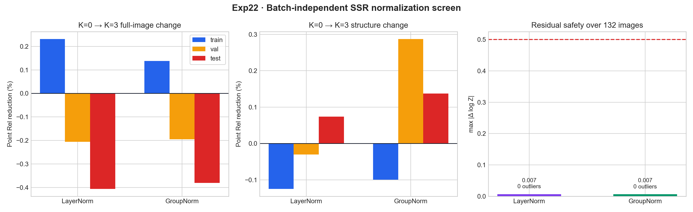

# Exp22：SSR 批次无关归一化短程筛选

## 实验问题

Exp17–21 已将当前复现的递归异常定位到 SSR 的 BatchNorm：原始运行统计会在少数
样本上产生极端残差，重校准人口统计不能根治；单图即时统计虽安全，却使验证和测试
退化。本实验不再调整 BN 缓冲，而是从相同的 MoGe-2 Base 和零初始化 SSR 重新训练，
直接比较两种不保存 batch 运行统计的归一化：

- LayerNorm：每个活动体素独立在全部通道上归一化；
- GroupNorm：每个活动体素独立在 8 个通道组内归一化。

论文没有公开稀疏 U-Net 使用的归一化，因此这是一项复现结构筛选，不宣称是论文消融。

## 固定控制

- 同一 100/16/16 Hypersim 划分与锁定细结构 ROI；
- 384×512、训练 K=3、评测 K=0/1/3/5；
- DINO 冻结，二维 neck/points head 与 SSR 均从同一初始状态开始；
- 前 200 步保持 detached 路由：K=0 更新二维模块，K=1/2/3 只更新 SSR；
- global batch 8、microbatch 1、无增强；
- SSR/二维头学习率分别为 2e-5/1e-6；
- 每种方案仅训练 200 步，先筛查稳定性和方向，不把短程结果当作收敛结果；
- 每种方案扫描全部 132 张样本的 K=1/2/3 残差，并完整评测 K=0/1/3/5。

## 判定规则

优先级依次为：

1. train/eval 行为必须一致，132 张扫描不得出现非有限值或绝对残差超过 0.5；
2. K=3 必须改善训练集，且验证、测试不得出现明显系统性退化；
3. 细结构与全图方向应尽可能一致；
4. 满足安全条件后，以验证与测试 K=3 Point Rel 选择下一轮完整训练方案。

## 运行记录

首次 4 张冒烟在训练前评测阶段失败：4 张子集未命中锁定结构 ROI，但选择指标仍设为
`structure_point_rel`。失败运行和堆栈保存在
`results/remote/failures/smoke_091309/`。修正为“冒烟选全图、正式实验仍选结构”后，
LayerNorm 和 GroupNorm 冒烟均完成，4 步内 K=3 Point Rel 分别从 1.2860% 降至
1.1795% 和 1.1778%。

正式流水线于 09:23:09–10:30:58 在 GPU 1 运行，退出码为 0。监控从 09:13:09
至 10:33:09 共检查 9 次，相邻间隔均为 600.06–600.08 秒，最终检查确认完成。

## 正式结果

### K=3 相对同检查点 K=0 的 SSR 独立贡献

正数表示 SSR 改善，负数表示 SSR 使结果变差。

| 归一化 | train 全图 | train 结构 | val 全图 | val 结构 | test 全图 | test 结构 |
|---|---:|---:|---:|---:|---:|---:|
| LayerNorm | +0.231% | −0.125% | −0.206% | −0.031% | −0.406% | +0.074% |
| GroupNorm | +0.138% | −0.099% | −0.195% | +0.287% | −0.381% | +0.137% |

两种方案的绝对 K=3 Point Rel 如下：

| 归一化 | train 全图/结构 | val 全图/结构 | test 全图/结构 |
|---|---:|---:|---:|
| LayerNorm | 5.6283% / 6.5251% | 8.9160% / 8.2459% | 7.4356% / 9.1106% |
| GroupNorm | 5.6336% / 6.5235% | 8.9150% / 8.2193% | 7.4336% / 9.1051% |

K=5 没有恢复明显收益。LayerNorm 的 train/val/test 全图分别为
5.6245%/8.9302%/7.4588%，GroupNorm 为 5.6313%/8.9279%/7.4537%；
递归增加只带来约千分之一量级变化。

### 残差安全性与资源

| 归一化 | 132 张越界数 | 最大绝对残差 | 训练峰值显存 | 200 步训练时间 |
|---|---:|---:|---:|---:|
| LayerNorm | 0 | 0.00702 | 11.02 GiB | 31.45 分钟 |
| GroupNorm | 0 | 0.00665 | 11.49 GiB | 30.78 分钟 |

两者最大残差比 0.5 安全阈值低约两个数量级，也不再存在 train/eval 行为分裂。

## 结论

本实验否定了“把 BatchNorm 直接换成逐体素 LayerNorm/GroupNorm”作为当前修复方案：

1. 它们确实彻底消除了运行统计失配和递归爆发；
2. 但也把 SSR 压成接近恒等映射，六个 train/val/test 全图与结构范围的独立贡献
   仅为 −0.41% 至 +0.29%，远小于 Exp15 在训练集上的有效修正；
3. GroupNorm 略优于 LayerNorm 的验证/测试结构结果，但幅度不足以证明有实际收益；
4. 这表明问题不是简单的归一化名字，而是统计轴：当前两种实现均对每个活动体素独立
   在通道维归一化，丢失了 BatchNorm 在整张稀疏壳上的通道分布信息。

下一项最小对照应恢复 BatchNorm 和完全相同的训练配置，只把真实 microbatch 从 1
提高到 2，使一次前向同时包含两张图；global batch 仍保持 8。它能直接检验论文大
batch 条件中“跨图像统计”是否同时保留学习能力并缩小 train/eval 失配。

## 产物

- 总报告：`results/remote/formal/report.json`
- 逐帧几何与残差：`results/remote/formal/{layer_norm,group_norm}/`
- 固定巡检证据：`results/remote/logs/monitor_checks.jsonl`
- 失败冒烟审计：`results/remote/failures/smoke_091309/`
- 对照图：`results/normalization_screen.png` 与 `.pdf`
- 服务器检查点大小与 SHA-256：`results/checkpoint_manifest.json`
