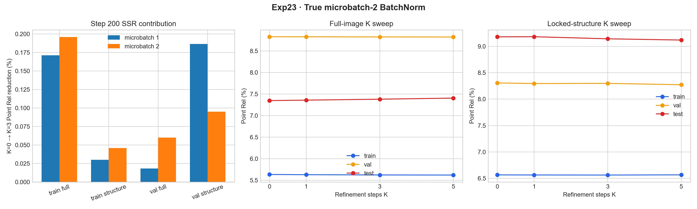

# Exp23：BatchNorm 真实双图 microbatch 对照

## 实验问题

Exp17–21 证明 microbatch 1 下训练的 SSR BatchNorm 存在 train/eval 统计失配；
Exp22 的逐体素 LayerNorm/GroupNorm 虽完全稳定，却把 SSR 压成近恒等映射。本实验
恢复原始重建使用的 BatchNorm，只改变一次真实前向包含的图像数：

- Exp15 基线：global batch 8，microbatch 1，靠 8 次梯度累积；
- 本实验：global batch 8，microbatch 2，靠 4 次梯度累积。

优化器每步看到的样本总数不变，唯一区别是 BatchNorm 每次统计同时来自一张还是两张
图。这直接检验论文大 batch 条件中的跨图像统计是否是稳定且有效学习的关键因素。

## 固定配置

- 同一 100/16/16 Hypersim 场景互斥划分与锁定细结构 ROI；
- 从同一 MoGe-2 Base 和零初始化 SSR 开始；
- 384×512、训练 K=3、评测 K=0/1/3/5；
- DINO 冻结，二维 neck/points head 与 SSR 同步训练；
- 200 步全部处于 detached 阶段：K=0 更新二维模块，K=1/2/3 只更新 SSR；
- BatchNorm、global batch 8、真实 microbatch 2、无增强；
- SSR/二维头学习率 2e-5/1e-6，AdamW、weight decay 1e-2；
- seed 151，与 Exp15 一致；
- 完整扫描 132 张的 K=1/2/3 残差，阈值 0.5。

## 判定

1. 冒烟实测显存必须在 GPU 1 当前安全余量内；
2. 最大残差与越界数应显著优于 Exp15 最终原始 BN 的 1.0458/6；
3. K=3 对 train 的修正应明显强于 Exp22 的千分之一量级；
4. val/test K=3 不应出现系统性退化；
5. 与 Exp15 step 200 的周期 train/val 数据作同训练步数对照。

## 运行记录

真实双图冒烟 4 步完成，峰值模型显存 13.66 GiB；加上 GPU 1 上既有进程后，
设备仍保留约 18.7 GiB 空间。正式流水线于 10:48:35–11:16:49 运行，退出码为
0，训练峰值模型显存 18.90 GiB。监控从 10:38:35 到 11:18:36 共检查 5 次，
相邻间隔均为 600.06–600.10 秒，最终检查确认完成。

## 正式结果

### 与 Exp15 microbatch 1 的同 step 200 对照

下表为 K=3 相对同检查点 K=0 的 Point Rel 改善率。两者 global batch 均为 8，
训练种子、数据顺序、学习率与梯度路由一致。

| 配置 | train 全图 | train 结构 | val 全图 | val 结构 |
|---|---:|---:|---:|---:|
| Exp15 microbatch 1 | +0.171% | +0.030% | +0.018% | +0.187% |
| Exp23 microbatch 2 | +0.196% | +0.046% | +0.060% | +0.095% |

差异没有形成一致优势：双图在三个范围略高，但验证结构反而更低。绝对 K=3 Point
Rel 也近乎相同，例如 train 全图为 5.6219% 对 5.6269%，val 全图为
8.8280% 对 8.8411%。这排除了“microbatch 从 1 增到 2 就能显著改变早期学习”
的解释。

### 完整 K 扫描

| K | train 全图/结构 | val 全图/结构 | test 全图/结构 |
|---:|---:|---:|---:|
| 0 | 5.6329% / 6.5634% | 8.8333% / 8.3074% | 7.3494% / 9.1822% |
| 1 | 5.6281% / 6.5619% | 8.8314% / 8.2966% | 7.3598% / 9.1849% |
| 3 | 5.6219% / 6.5604% | 8.8280% / 8.2995% | 7.3818% / 9.1452% |
| 5 | 5.6196% / 6.5644% | 8.8268% / 8.2738% | 7.4071% / 9.1216% |

K=3 相对 K=0 在测试全图退化 0.441%，测试结构改善 0.403%。逐帧统计中
60/100 张训练图、9/16 张验证图、5/16 张测试图的全图 Point Rel 改善，留出场景
没有稳定多数收益。验证和测试的锁定结构各只有一个 ROI，其结构方向只能作为诊断，
不能当作泛化统计。

### 稳定性

- 132 张、K=1/2/3 扫描均为有限值；
- 绝对残差超过 0.5 的样本数：0；
- 最大绝对对数深度残差：0.00724；
- best step：200；
- 200 步训练时间：25.27 分钟。

该安全结果不能直接证明 microbatch 2 根治后期异常：Exp15 的极端残差是在继续训练
至 step 800、SSR 已学出更强修正后才暴露。本实验 step 200 的残差仍与 Exp22 的
近恒等方案同量级。

## 结论

当前数据不支持“论文没有异常主要因为 batch 96，而我们 batch 太小”这一单因解释。
关键原因是：

1. BatchNorm1d 的统计样本是活动体素而非图像，一张 384×512 图已经提供约 19.7 万
   个特征行；从一张增到两张，对均值和方差的边际影响有限；
2. global batch 8 的梯度随机性本来就通过累积保持不变，microbatch 变化只影响归一化
   统计，不能自动改善数据域覆盖；
3. step 200 时 SSR 尚未形成较大残差，因此两种 microbatch 都安全但收益很弱。

下一步应从本实验 step 200 的完整优化器/RNG 状态继续到 step 800，再与 Exp15
step 800 做同训练强度的残差、train/val/test 和 K 扫描对照。这才能回答真实双图
统计是否推迟或消除了后期离群。

## 产物

- 总报告：`results/remote/formal/report.json`
- 完整逐帧指标与残差：`results/remote/formal/`
- 固定巡检证据：`results/remote/logs/monitor_checks.jsonl`
- 检查点大小与 SHA-256：`results/checkpoint_manifest.json`
- 对照图：`results/microbatch2_audit.png` 与 `.pdf`
