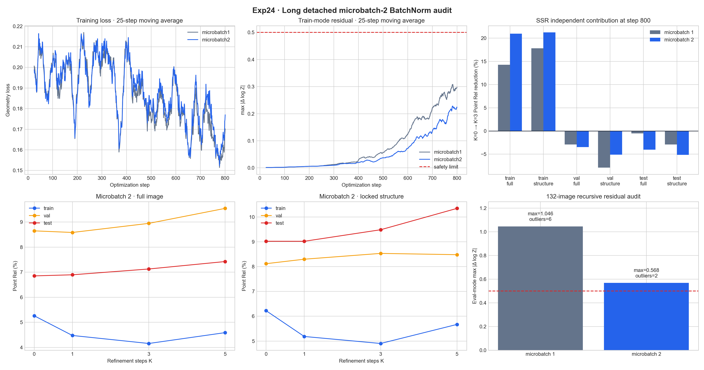

# Exp24：真实双图 BatchNorm 长程 detached 对照

## 实验问题

Exp23 将真实 microbatch 从 1 提到 2，在 step 200 的学习曲线和几何指标上与 Exp15
几乎一致。此时两者的 SSR 残差都很小，不能回答双图统计能否避免 Exp15 在 step 800
出现的 eval 模式离群。

本实验从 Exp23 step 200 的完整模型、优化器和 RNG 状态原样继续至 step 800；
训练数据、顺序、损失、学习率和 detached 路由均保持不变。最终与 Exp15
microbatch 1 的 step 800 检查点直接比较：

- 132 张残差最大值与越界样本数；
- K=0/1/3/5 的 train/val/test 全图与结构指标；
- K=3 相对同检查点 K=0 的 SSR 独立贡献；
- 训练过程是否出现跳步、崩塌或残差保护。

## 固定配置

- 100/16/16 Hypersim 场景互斥划分；
- 384×512、num tokens 2500、训练 K=3；
- BatchNorm、global batch 8、真实 microbatch 2；
- DINO 冻结，二维 neck/points head 与 SSR 同步训练；
- step 1–800 全程 detached；
- SSR/二维头学习率 2e-5/1e-6；
- 从 Exp23 `resume_checkpoint.pt` 的 step 200 继续，保留 AdamW 与 RNG；
- 每 100 步评测，step 800 使用最终检查点做完整 K 扫描和残差扫描；
- 绝对对数深度残差保护阈值仍为 0.5。

## 判定

如果 step 800 的最大残差和离群数明显低于 Exp15 的 1.0458/6，同时保留 Exp15
训练集上约 13% 的 SSR 独立改善，才支持真实跨图像统计有效。若学习强度与离群情况
都近似 Exp15，则 microbatch 不是主因；若稳定但 SSR 同样很弱，则只是延缓学习。

## 运行记录

恢复点审计确认源检查点为 step 200、global batch 8、microbatch 2、BatchNorm，
并包含 AdamW、CPU RNG 与局部损失 RNG 状态。正式流水线于
2026-08-02 11:45:01–13:02:57 在物理 GPU 1 运行，退出码为 0。训练自身从
step 200 续至 800，用时 74.81 分钟，峰值模型显存 18.63 GiB；0 次梯度更新
跳过、无 NaN/OOM，也没有在训练中触发 0.5 残差保护。

监督器从 11:25:00 到 13:05:01 共记录 11 次，相邻间隔为
600.061–600.441 秒。首次检查因 GPU 1 瞬时利用率较高而等待；step 300 保存
1.9 GiB 恢复点时曾进入共享文件系统 `wait_on_commit`，约 4 分钟后自行恢复，
没有丢步或损坏检查点。

## 正式结果

### 同 step 800 的 K 扫描

下表为绝对 Point Rel，越低越好；每格依次为全图/锁定结构。锁定结构在训练、
验证、测试中分别只有 53/1/1 个 ROI。

| K | Train | Val | Test |
|---:|---:|---:|---:|
| 0 | 5.2624% / 6.2236% | 8.6466% / 8.1160% | 6.8518% / 9.0200% |
| 1 | 4.4774% / 5.1847% | **8.5824%** / 8.2967% | **6.8955%** / **9.0185%** |
| 3 | **4.1582%** / **4.9025%** | 8.9448% / 8.5307% | 7.1268% / 9.4833% |
| 5 | 4.5911% / 5.6707% | 9.5423% / 8.4789% | 7.4237% / 10.3440% |

K=3 相对同检查点 K=0 的 SSR 独立贡献为：

| 配置 | Train 全图 | Train 结构 | Val 全图 | Val 结构 | Test 全图 | Test 结构 |
|---|---:|---:|---:|---:|---:|---:|
| Exp15 microbatch 1 | +14.26% | +17.80% | −2.90% | −7.88% | −0.50% | −2.92% |
| Exp24 microbatch 2 | **+20.98%** | **+21.23%** | −3.45% | −5.11% | −4.01% | −5.14% |

双图没有把 SSR 压成恒等映射，反而得到更强训练拟合：99/100 张训练图的 K=3
全图 Point Rel 改善，47/53 个锁定结构 ROI 改善。但留出集只有 5/16 张验证图
和 3/16 张测试图改善，说明强修正主要记住了训练域。

K=1 是留出集最稳的推理点：验证全图较 K=0 改善 0.74%，测试全图退化 0.64%；
继续到 K=3/5 后全图和结构总体恶化。所学共享更新仍不是论文中随迭代稳定饱和的
收敛修正。

### 边界与视觉目标

最终 Boundary F1 为：

| 划分 | K=0 | K=1 | K=3 | K=5 |
|---|---:|---:|---:|---:|
| Train | 0.8024 | **0.8039** | 0.7972 | 0.7882 |
| Val | **0.8563** | 0.8539 | 0.8414 | 0.8250 |
| Test | **0.8244** | 0.8218 | 0.8118 | 0.7963 |

因此训练 Point Rel 的 20% 以上改善并没有变成锐利边缘；K 越大，Boundary F1
越低。这解释了平均点误差看起来不错、点云细杆观感仍不接近官网 Demo 的现象。

### 递归残差安全

| 配置 | 132 张越界数 | 最大 eval 残差 | 最坏迭代 |
|---|---:|---:|---:|
| Exp15 microbatch 1 | 6 | 1.0458 | K=3 |
| Exp24 microbatch 2 | **2** | **0.5683** | K=3 |

真实双图统计使越界图减少 66.7%，最大残差下降 45.7%。两个剩余离群样本均来自
训练集：`ai_001_001_cam_00_frame.0099` 与
`ai_026_019_cam_00_frame.0000`；K=1/2 均无越界，只有第三轮超过 0.5。
所以 microbatch 2 是有效的稳定性改进，但没有根治共享递归与 BatchNorm 的拓扑
敏感性。

## 为什么效果仍不接近论文 Demo

现有证据支持以下分层判断。

1. **SSR 主路径已经会学习。** 训练 K=0→K=3 全图/结构改善
   20.98%/21.23%，不是“SSR 没有更新”。论文冻结 Base 的 D=200 消融将局部点
   Rel 从 3.19 降至 2.76，相对改善约 13.48%；当前训练域的相对学习量并不弱。
2. **小数据单域过拟合是主要矛盾。** 当前只有 100 张 Hypersim；论文使用 17 个
   合成和 8 个真实/重建数据集。当前 val/test 各只有两个场景、每个场景八个相关
   帧，留出指标对单个场景极敏感。Base/二维头的 K=0 能同时改善 train/val，而
   SSR 的 K=3 只稳定改善 train，问题主要集中在精修规则的跨场景泛化。
3. **输入分辨率限制细杆上限。** 当前 384×512 只有 196,608 像素；论文展示
   700²/840² 配置，840² 的像素数是当前的 3.59 倍。Hypersim 还从
   768×1024 下采样，许多细杆只剩 1–2 像素。SSR 只能移动现有像素的深度，不能
   恢复缩放时已经消失的轮廓。
4. **优化目标与展示目标不完全一致。** 训练损失覆盖全图，手工细结构 ROI 只用于
   评测和选检查点，不直接增加这些像素的训练权重。后期全局/局部损失下降时，
   Boundary F1 仍下降。当前 `edge_loss` 还沿用 MoGe-2 的
   `max(H,W)` 分母，而论文式 (13) 使用 `min(H,W)`；在 384×512 下当前边缘项
   比论文公式再小 25%。该偏差值得修正，但 Exp5 已证明单独把 edge 权重提高到 4
   仍不能解决泛化。
5. **“结构指标”不是论文 Local 掩码。** 当前 ROI 在人工裁剪内取 GT 近深度
   50%，训练/验证/测试为 53/1/1 个区域；论文使用多尺度视差拉普拉斯与分割扩张
   自动提取精细结构。当前数值只能用于内部诊断，不能与论文 Local 指标直接比较，
   也不保证严格覆盖 GIF 中关注的杆。
6. **稀疏 U-Net 的关键实现细节仍是重建假设。** 论文没有公开归一化类型、精确
   通道和残差块细节；BatchNorm 是本复现补全的选择。Exp17–24 已证明它会显著影响
   共享递归行为，不能把当前异常归因于论文思想本身。
7. **当前只完成论文第一阶段的缩小版。** 本实验全程 detach、DINO 冻结，SSR/二维
   头学习率为 2e-5/1e-6；论文前 5,000 步 detach 后联合训练，峰值学习率为
   2e-4/1e-4/5e-6，并使用全局 batch 96。当前实验验证的是小数据学习机制，不是
   完整论文收敛点。

## 结论与下一步

Exp24 支持三个结论：

1. 把真实 microbatch 从 1 增到 2 能在保持强训练学习的同时显著减少 BatchNorm
   推理态离群，因此后续若继续使用 BatchNorm，应至少保留 microbatch 2；
2. 它不能解决小数据下的细结构泛化、Boundary F1 退化和 K=5 过修正；
3. 继续单纯增加 step、K 或 microbatch 的收益已经有限，下一步应先检查训练目标
   是否真正给细杆足够梯度。

下一项 Exp25 先做损失梯度与结构像素占比审计：在固定检查点上分别量化 global、
local、edge 对对数深度的梯度，并修正矩形输入下 edge 分母与论文不一致的问题。
只有证据确认结构监督不足后，才进行结构感知裁剪/采样与更高分辨率训练，避免再次
无依据扫描 loss 权重。

## 产物

- 总报告：`results/remote/formal/report.json`
- 完整 K 扫描与逐帧指标：`results/remote/formal/evaluation/`
- 132 张残差报告：`results/remote/formal/residual/`
- 训练历史与曲线：`results/remote/formal/training/`
- 固定巡检证据：`results/remote/logs/monitor_checks.jsonl`
- 汇总图：`results/microbatch_long_audit.png` 与 `.pdf`
- 检查点大小与 SHA-256：`results/checkpoint_manifest.json`

大型检查点只保留在服务器安全目录，不提交 Git。
