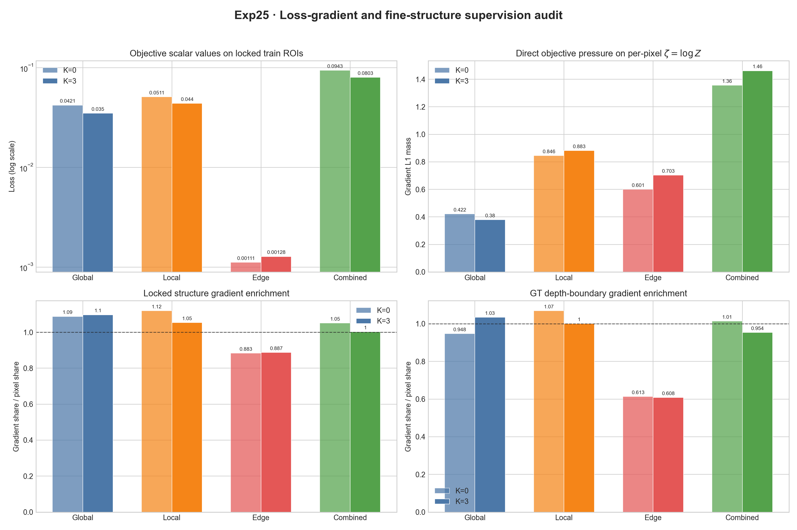

# Exp25：损失梯度与细结构监督审计

## 实验问题

Exp24 已证明 SSR 在 100 张 Hypersim 训练图上有很强的拟合能力，但验证、测试和
Boundary F1 仍会退化。本实验不继续盲目调权重，而是在 Exp24 step 800 固定检查点
上回答三个问题：

1. global、radial local、edge 三项对每像素对数深度 \(\zeta=\log Z\) 的实际梯度
   各有多大；
2. 锁定 crop、近深度“结构”区域与 GT 深度边界获得的梯度质量是否与其像素占比
   相称；
3. 当前 V3 的矩形输入 edge 归一化是否与论文公式一致。

## 固定设计

- 使用 Exp24 `latest_checkpoint.pt`，不更新任何模型参数；
- 使用 384×512、K=0 与 K=3；
- 正式审计取数据清单顺序中前 12 个带锁定 ROI 的训练样本，并保留全部验证/测试
  ROI；数据清单与 ROI 均在查看预测前锁定；
- 分别对 global、local、旧 edge、论文 edge 和论文三项合计求
  \(\partial L/\partial\zeta\)；
- 报告 crop、结构和 GT 边界的像素占比、梯度质量占比及富集倍数；
- 这里测量的是损失函数对理想逐像素深度变量的直接压力，尚未乘上 SSR 网络
  Jacobian，因此用于诊断监督目标，不冒充参数梯度。

论文式 edge 使用 `min(H,W)` 归一化；MoGe-2 兼容入口继续默认使用
`max(H,W)`，V3 几何损失统一切换到论文式入口。

## 结果

冒烟审计于 13:15:27–13:15:58 在物理 GPU 1 完成。第一次正式启动仅在新增的
CUDA 峰值显存计数器处因 PyTorch 2.8 设备参数兼容问题退出，尚未加载模型到 GPU，
该状态与日志被保留为 `formal_attempt1_failed`。显式设置可见 CUDA 设备后，正式
审计于 13:27:37–13:28:10 完成；核心计算耗时 12.78 秒，峰值分配/保留显存为
2.10/2.30 GiB。没有 OOM、NaN 或非有限梯度。固定监控分别在 13:15:27、
13:25:27 和 13:35:27 执行，两个实际间隔为 600.067 和 600.068 秒，末次状态为
`complete`。

### K=0→K=3 的目标变化

下表在同一 Exp24 step 800 检查点内比较，正数表示 K=3 的论文三项合计目标下降：

| 划分 | 样本数 | K=0 合计 | K=3 合计 | 相对变化 |
|---|---:|---:|---:|---:|
| Train 锁定 ROI | 12 | 0.09435 | 0.08028 | **+14.91%** |
| Val 锁定 ROI | 1 | 0.07723 | 0.07862 | −1.81% |
| Test 锁定 ROI | 1 | 0.05412 | 0.05933 | −9.64% |

这与 Exp24 的 Point Rel 方向一致：所选 12 张训练图的 K=3 全图与结构均全部优于
K=0，验证结构和测试结构则退化。损失本身已经显示出相同的 train/leaveout 分裂，
因此主要现象不是评测器偶然波动，而是 SSR 修正对训练域的适配。

### 标量大小不等于梯度大小

训练 ROI 上 K=3 的均值为：

| 目标 | Loss | 对逐像素 log-depth 的梯度 L1 |
|---|---:|---:|
| Global | 0.03504 | 0.3799 |
| Radial local | 0.04396 | 0.8828 |
| Paper edge | 0.001277 | 0.7031 |
| 三项合计 | 0.08028 | 1.4622 |

edge 的标量比 global/local 小一个数量级，但它对 \(\zeta\) 的直接梯度总量并不小。
所以不能根据训练日志中的 `edge≈0.001` 直接判断边缘监督“没有作用”，也不支持
继续无依据提高 edge 权重。

### 梯度位置与方向

富集倍数定义为“区域梯度质量占比 / 区域有效像素占比”；1 表示与均匀逐像素施力
相同。训练 ROI 的 K=3 结果为：

| 目标 | 锁定结构富集 | GT 深度边界富集 |
|---|---:|---:|
| Global | 1.097 | 1.034 |
| Radial local | 1.054 | 1.001 |
| Paper edge | **0.887** | **0.608** |
| 三项合计 | 1.003 | 0.954 |

当前 edge-angle loss 作用于所有相邻有效像素的三维方向，而不是只作用于 GT
深度不连续。它的梯度很大，却在本审计定义的 GT 边界上仅获得按像素均匀分配的
60.8%，这解释了“有 edge loss，但细杆边界仍不够锐利”的一部分原因。这里的
GT 边界使用当前内部阈值代理，不等同于论文最终 Boundary F1 协议。

K=3 的逐像素梯度余弦为：

| 梯度对 | 余弦 |
|---|---:|
| Global / Local | 0.412 |
| Global / Edge | **0.076** |
| Local / Edge | 0.321 |

global 与 edge 几乎正交。结合 Exp24 训练中 global/local 下降、K=3 edge
从约 0.00058 上升到 0.00079，以及 Boundary F1 下降，可判断当前优化会优先降低
平均几何误差，同时牺牲部分边缘目标。

### 论文 edge 公式修正

旧 V3 路径复用了 MoGe-2 的 `max(H,W)` 分母，论文式 (13) 使用
`min(H,W)`。在 384×512 上，正式审计测得论文/旧实现：

- loss 比值：1.33333337；
- 梯度 L1 比值：1.33333339；
- 理论比值：1.33333333。

现已为 V3 增加独立论文式入口并切换所有 V3 训练路径；MoGe-2 兼容入口的默认行为
保持不变。该修正会使后续边缘监督增强 33.3%，但 Exp5 的 edge 权重 4 消融仍未
解决验证泛化，因此不能把它视为单独的最终修复。

## 结论与下一步

Exp25 排除了“edge 只是数值太小、完全没有梯度”这一简单解释，并支持：

1. 当前主要分裂仍是小规模单一 Hypersim 训练域过拟合；
2. 三项合计对锁定结构只提供近似按像素占比的监督，没有专门强化细杆；
3. edge 的逐像素梯度较强，但空间位置不集中，且与 global 梯度方向弱一致；
4. 还不能仅凭逐像素梯度断言 SSR 参数梯度同样强，因为稀疏卷积共享参数可能让
   相邻正负高频梯度在网络 Jacobian 后抵消。

下一项 Exp26 应在 Exp24 固定检查点和真实 microbatch 2 上，对 global、local、
edge 分别求 SSR 实际参数梯度范数及夹角。若 edge 在逐像素空间强、到 SSR 参数
空间后显著变弱或与 global 冲突，再设计梯度平衡或结构感知采样；否则优先转向数据
多样性和更高分辨率，不继续扫描 loss 权重。

## 产物

- 可复现摘要：`results/summary.json`
- 全部逐样本梯度：`results/remote/formal/per_sample_gradients.csv`
- 聚合数据：`results/remote/formal/aggregate_gradients.csv`
- 正式报告：`results/remote/formal/report.json`
- 汇总图：`results/loss_gradient_audit.png` 与 `.pdf`
- 冒烟、失败重试和固定巡检证据：`results/remote/`
