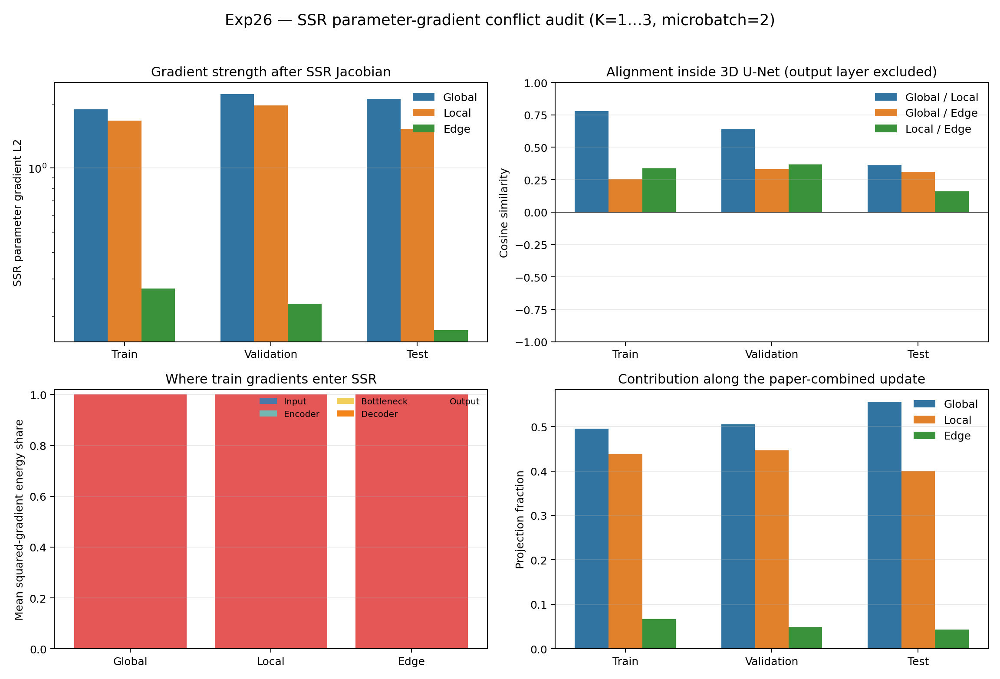

# Exp26：SSR 参数梯度冲突审计

## 实验问题

Exp25 发现 edge 对逐像素 log-depth 的直接梯度并不弱，但这还没有经过 SSR 稀疏
U-Net 的 Jacobian。Exp26 固定 Exp24 step 800 检查点，进一步回答：

1. global、radial local、edge 到达 5074 万个 SSR 参数后各有多强；
2. 三项参数梯度是否互相冲突；
3. edge 信号是否只停留在输出层，或能传到编码器、瓶颈和解码器；
4. 论文 edge 分母修正是否足以改变合计更新方向。
5. Train、Validation、Test 的有效 batch 参数梯度是否彼此冲突。

## 固定设计

- 不训练、不执行优化器更新；
- Base/2D Head 设为 eval、完全冻结，并在进入 SSR 前 detach；
- SSR 保持 train 模式，使用真实两图 microbatch 的 BatchNorm 当前批统计；
- 每个 batch 前恢复检查点的 BatchNorm buffer，消除样本顺序造成的状态漂移；
- Train/Val/Test 各按预测前数据清单顺序取前 8 张，连续组成 4 个双图 batch；
- 除逐 microbatch 统计外，精确平均 4 份完整梯度向量，报告与 Exp24 一致的有效
  batch=8 更新方向，而不是对梯度范数做标量平均；
- 损失与训练一致，对 K=1、2、3 累加；
- 分别求 global、local、论文 edge 的参数梯度，并代数组合出：
  - 检查点历史目标：`global + local + 0.75 × paper_edge`；
  - 修正后论文目标：`global + local + paper_edge`。

本实验测量当前检查点附近的一阶局部行为，不把梯度夹角冒充重新训练后的最终结果。

## 结果

冒烟任务于 13:41:54–13:42:25 在物理 GPU 1 完成。正式任务由固定监控器于
13:51:54 启动，首次完整输出于 13:52:54 完成；随后只读重算补充了有效 batch
向量平均、跨划分和非输出层分解。最终核心计算耗时 42.26 秒，峰值分配/保留显存为
17.68/17.98 GiB，没有 OOM、NaN 或非有限梯度。126 个 SSR 参数张量均有梯度。

固定监控分别在 13:41:54、13:51:54 和 14:01:54 执行，两个实际间隔为
600.065 和 600.069 秒，末次状态为 `complete`。

### edge 经过 SSR 后明显变弱

下表使用与 Exp24 一致的有效 batch=8，即先精确平均 4 份 microbatch=2 的完整
梯度向量，再计算范数和夹角：

| 划分 | Global L2 | Local L2 | Edge L2 | Edge/Global | Edge/Local | Edge 沿合计更新的投影 |
|---|---:|---:|---:|---:|---:|---:|
| Train | 1.893 | 1.672 | 0.270 | 14.28% | 16.16% | 6.68% |
| Validation | 2.228 | 1.970 | 0.229 | 10.28% | 11.63% | 4.91% |
| Test | 2.116 | 1.529 | 0.173 | 8.16% | 11.29% | 4.35% |

Exp25 中 edge 对理想逐像素 log-depth 的直接梯度并不弱；经过共享稀疏 U-Net
Jacobian 后，它只有 global 的 8%–14%，在实际三项合计方向中只贡献约
4%–7%。因此“edge 标量小但逐像素梯度强”不代表 SSR 参数会收到同等强度的边缘
更新，网络参数化确实削弱了这部分信号。

### 总梯度一致是输出层主导造成的

有效 Train batch 中，输出层占 global、local、edge 梯度平方能量的
99.72%、99.86% 和 99.96%；Validation/Test 也均超过 99%。若包含输出层，三项
梯度余弦为 0.92–0.99，看起来高度一致；去掉仅 33 个输出层参数后：

| 划分 | Global/Local | Global/Edge | Local/Edge |
|---|---:|---:|---:|
| Train | 0.779 | **0.258** | 0.338 |
| Validation | 0.637 | **0.332** | 0.368 |
| Test | 0.361 | **0.311** | **0.160** |

所以 edge 与 global 并非在完整参数空间中强烈反向冲突，但在真正的编码器、瓶颈和
解码器内部，它们只有弱到中等的一致性。输出层的共同大梯度掩盖了这种差异。

### 留出集退化不是一个简单的整体反向梯度

三项合计梯度的跨划分余弦为：

| 划分对 | 全部 SSR 参数 | 仅输出层 | 去掉输出层 |
|---|---:|---:|---:|
| Train / Validation | 0.995 | 0.996 | **0.446** |
| Train / Test | 0.994 | 0.995 | **0.447** |
| Validation / Test | 0.995 | 0.997 | **0.330** |

完整梯度没有出现负余弦，因此不能把 Exp24 的验证退化解释为“训练梯度必然直接增大
验证损失”。更准确的解释是：各划分都强烈推动同一个最终输出映射，但内部三维表示
的更新只有有限一致性；在小规模、单一 Hypersim 域和 800 步训练下，输出层容易
拟合训练集，而稀疏 U-Net 内部尚未形成稳定、可迁移的细结构规律。该结论仍是当前
检查点附近的一阶诊断，不能代替完整训练轨迹。

### 修正 edge 分母不是单独的解法

将检查点历史使用的 `max(H,W)` edge 换成论文 `min(H,W)` 后，合计参数梯度方向的
余弦在 Train/Validation/Test 分别为 0.999982、0.999990 和 0.999995；合计范数只
增加 1.70%、1.24% 和 1.10%。公式修正是必要的实现对齐，但它几乎不改变当前更新
方向，无法单独解决泛化和细杆问题。

## 结论与下一步

Exp26 支持以下判断：

1. SSR 不是“没有 edge 梯度”，但 edge 穿过当前网络后相对 global/local 明显
   衰减；
2. 原始参数梯度被零初始化历史下成长起来的输出层强烈主导，内部三维模块看到的损失
   方向远没有总余弦显示得一致；
3. 这解释了为何单图/小集可以靠输出映射快速拟合，而扩展到 100 张后训练收益难以
   转化成稳定泛化；
4. 不能直接据此提高 edge 权重：训练使用 AdamW、全局梯度裁剪和历史二阶矩，原始
   L2 能量并不等于最终参数位移。

下一项应优先审计 Exp24 优化器状态下的梯度裁剪与 AdamW 预条件更新，比较输出层和
非输出层的实际更新能量。若预条件后仍由输出层主导，再考虑延长 detached 预热、
分层学习率或内部深监督；若 AdamW 已充分放大内部更新，则更应优先增加数据多样性和
分辨率，而不是继续扫描 edge 权重。

## 产物

- `results/summary.json`
- `results/parameter_gradient_audit.png` 与 `.pdf`
- `results/remote/formal/report.json`
- `results/remote/formal/per_batch_objectives.csv`
- `results/remote/formal/per_batch_cosines.csv`
- `results/remote/formal/per_group_gradients.csv`
- `results/remote/formal/effective_batch_objectives.csv`
- `results/remote/formal/effective_scope_cosines.csv`
- `results/remote/formal/cross_split_cosines.csv`
- 冒烟、正式重算和固定巡检日志：`results/remote/`
